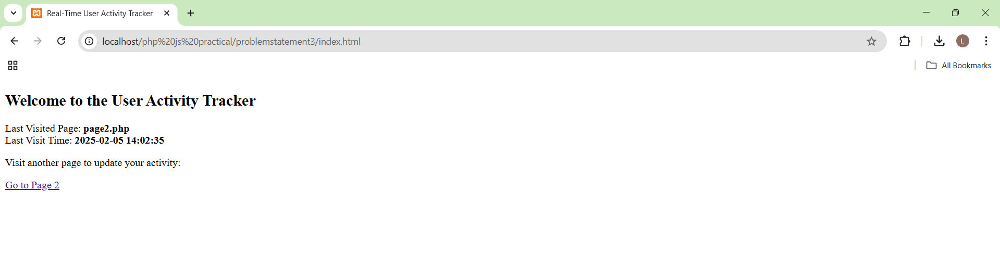
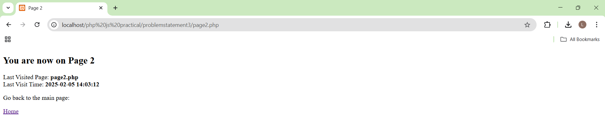

<h2>✅ Problem Statement 1: Student Registration Form</h2>
        <ul>
            <li>Created a student registration form with fields like <b>Username, Email, Phone, Password, Confirm Password</b>.</li>
            <li>Implemented client-side validation using JavaScript:</li>
            <ul>
                <li>Fields cannot be empty.</li>
                <li>Phone number must be exactly <b>10 digits</b>.</li>
                <li>Password must have at least <b>one uppercase letter, one number, and one special character</b>.</li>
                <li>Password and Confirm Password must match.</li>
            </ul>
        </ul>
        <b>Screenshot:</b>
        

<h2>✅ Problem Statement 2: DOM Manipulation & jQuery</h2>
        <ul>
            <li>Used <b>getElementById, getElementsByTagName, getElementsByClassName</b> for DOM manipulation.</li>
            <li>Updated <b>innerHTML</b> dynamically to change text.</li>
            <li>Changed CSS styles dynamically (e.g., color, position).</li>
            <li>Switched images dynamically on button click.</li>
            <li>Added and removed elements from the DOM dynamically.</li>
            <li>Used jQuery for:</li>
        </ul>
         <b>Screenshot:</b>
         <h4> Before</h4>
        
        <h4> After</h4>
        

<h2>✅ Problem Statement 3: Real-Time User Activity Tracker</h2>
        <ul>
            <li>Used <b>PHP cookies</b> to track the last visited page and timestamp.</li>
            <li>JavaScript retrieves the cookie values and displays the information dynamically.</li>
            <li>Cookies update every time the user navigates to a new page.</li>
        </ul>
        <b>Screenshot:</b>
        <h4>Page 1</h4>
        
        <h4>Page 2</h4>
        
